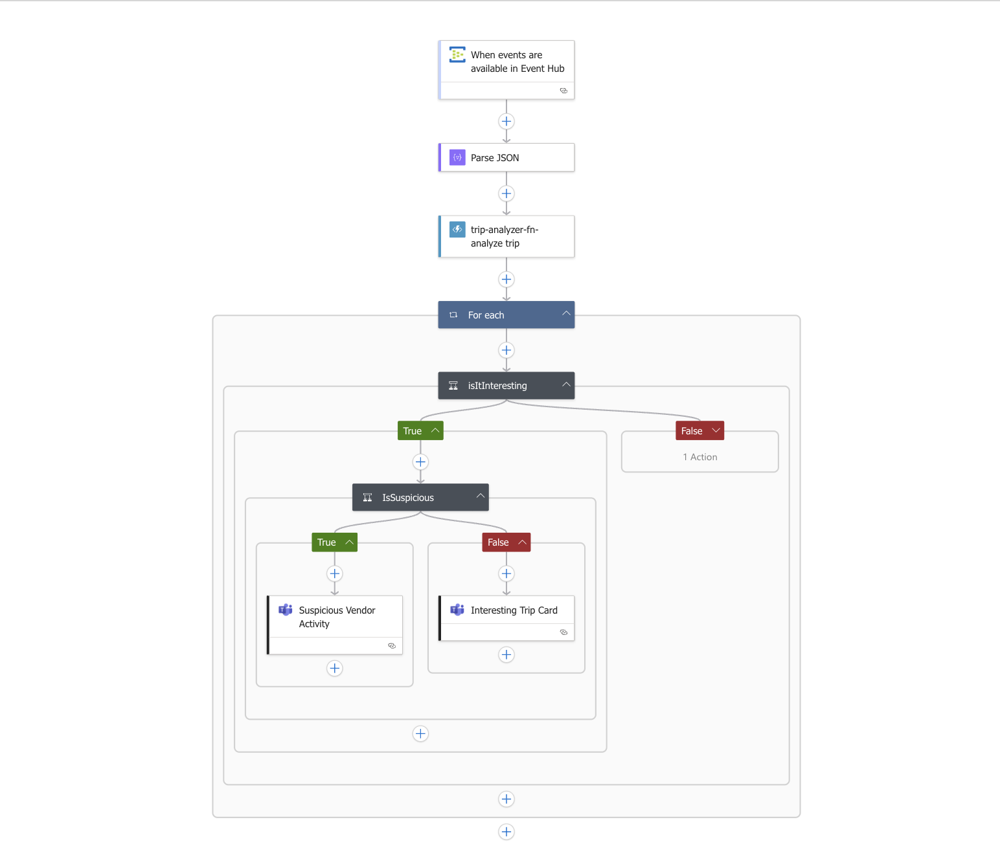

# Real-Time Trip Monitoring System – CST8917 Lab 4

This project implements a **real-time trip event analysis pipeline** for a taxi dispatch network using **Azure Event Hub**, **Azure Functions**, **Logic Apps**, and **Microsoft Teams Adaptive Cards**.

## Scenario

You're working for a transportation tech company supporting city-wide taxi fleets. The system detects suspicious or notable trips in real time and notifies operations staff via Microsoft Teams.

## Architecture Overview

1. **Trip events** are sent to **Azure Event Hub**.
2. A **Logic App** is triggered in batch mode.
3. The Logic App calls an **Azure Function** that analyzes each trip.
4. Based on the result, the Logic App posts **Adaptive Cards** to Teams.



---

## Sample Payloads and Expected Results

### Normal Trip (No Issues)
```json
{
  "ContentData": {
    "vendorID": "V999",
    "tripDistance": 3.0,
    "passengerCount": 2,
    "paymentType": "1"
  }
}
```
**Result**:
- insights: []
- isInteresting: false
- summary: "Trip normal"

---

### Suspicious Vendor Activity
```json
{
  "ContentData": {
    "vendorID": "V100",
    "tripDistance": 0.5,
    "passengerCount": 5,
    "paymentType": "2"
  }
}
```
**Result**:
- insights: ["GroupRide", "CashPayment", "SuspiciousVendorActivity"]
- isInteresting: true

---

### Interesting Trip Detected - Long Trip
```json
{
  "ContentData": {
    "vendorID": "V200",
    "tripDistance": 12.0,
    "passengerCount": 1,
    "paymentType": "1"
  }
}
```
**Result**:
- insights: ["LongTrip"]
- isInteresting: true

---

### Interesting Trip Detected - Group Ride (Non-Cash)
```json
{
  "ContentData": {
    "vendorID": "V400",
    "tripDistance": 5.2,
    "passengerCount": 6,
    "paymentType": "1"
  }
}
```
**Result**:
- insights: ["GroupRide"]
- isInteresting: true

---

### Short Cash Ride (Not Suspicious)
```json
{
  "ContentData": {
    "vendorID": "V500",
    "tripDistance": 3.3,
    "passengerCount": 3,
    "paymentType": "2"
  }
}
```
**Result**:
- insights: ["CashPayment"]
- isInteresting: true

---

## Azure Components

- **Event Hub**: `taxi-trips` – accepts trip data from producers.
- **Function App**: `trip-analyzer-fn` – performs real-time trip analysis.
- **Logic App**: `trip-analysis-logic` – orchestrates workflow & routing.
- **Microsoft Teams Webhook**: Sends Adaptive Cards to ops team.

---

## Logic App Logic

- Trigger: Event Hub (batch)
- Action: HTTP POST to Azure Function
- For each response:
  - If `isInteresting` is true:
    - If `"SuspiciousVendorActivity"` in `insights` → Suspicious Card
    - Else → Interesting Card
  - Else → No Issues Card

---

## Demo Video

Watch how the full system works:  
[Demo Video on YouTube](https://youtu.be/your-video-link-here)

---

## Repo Structure

```
trip-analyzer-fn/
├── function_app.py                  # Azure Function
├── simulate/
│   └── send_trip_event.py        # Python Event Hub simulator
├── logic-app/
│   └── trip-analysis-logic.json  # Logic App definition (exported)
├── media/
│   └── architecture.png          # Diagram
├── .env                          # (not committed)
├── requirements.txt
└── README.md
```